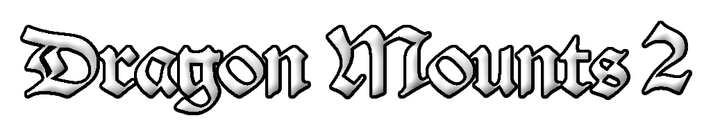

## License

The mods binaries, as well as its textures and code are licensed under the **GPLv3 license**.

Feel free to use the mod in any modpacks. You are allowed to use it, you do not need to ask for permission,
in fact permission requests will usually be ignored. When using the mod, please use the Curse/CurseForge, Modrinth,
or GitHub to download and do not rehost the files.

Any modpack which uses Dragon Mounts 2 takes full responsibility for user support queries.
For anyone else, we only support official builds from Curse/CurseForge, Modrinth, and GitHub, not custom built jars.
We also do not take bug reports for outdated builds of Minecraft.
